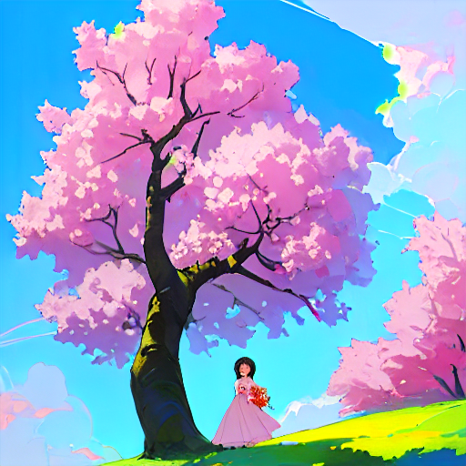
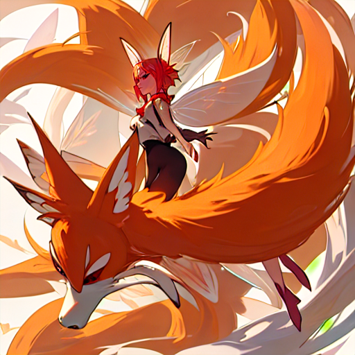
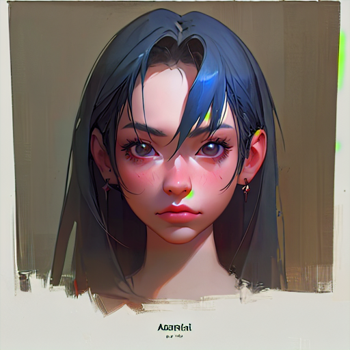
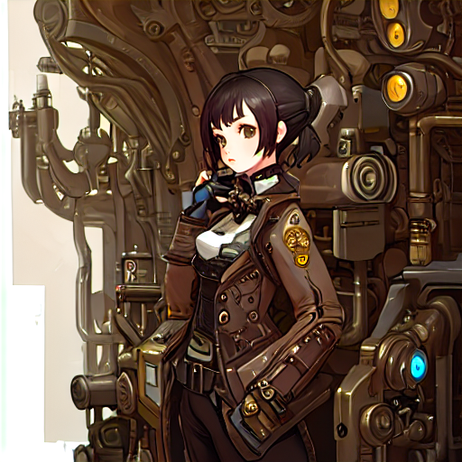
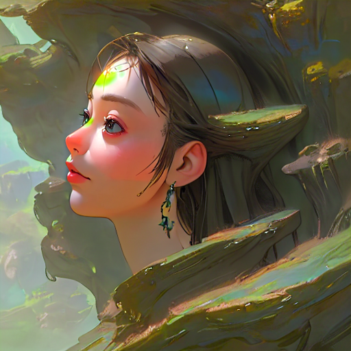

# 가중통제

(https://github.com/minkkjean/AI_Project_2026_01_3B/blob/main/PROMPTADV/00030-2963086612.png?raw=true)

> masterpiece, (1girl :1.0), (flower:1.0), (tree :1.0), (sky :1.7)

# prompt alternating

 (https://github.com/minkkjean/AI_Project_2026_01_3B/blob/main/PROMPTADV/00004-155380136.png?raw=true)

> masterpiece, (1girl :1.0), (flower:1.0), (tree:1.0), (sky, :1,0)

# Blend two keywords
 (https://github.com/minkkjean/AI_Project_2026_01_3B/blob/main/PROMPTADV/00069-1630507228.png?raw=true)

> masterpiece, [nine-tailed_fox : fairy wings : 0.5]

 (https://github.com/minkkjean/AI_Project_2026_01_3B/blob/main/PROMPTADV/00063-2381735867.png?raw=true)

> masterpiece, realistic, Arcanepunk, portrait, wide_shot, portrait,

 (https://github.com/minkkjean/AI_Project_2026_01_3B/blob/main/PROMPTADV/00066-1399615970.png?raw=true)

> masterpiece, [steampunk | science fiction] 1girl,

(https://github.com/minkkjean/AI_Project_2026_01_3B/blob/main/PROMPTADV/00046-2915542968.png?raw=true)

> masterpiece, realistic, Fantasy, Face, wide_shot
